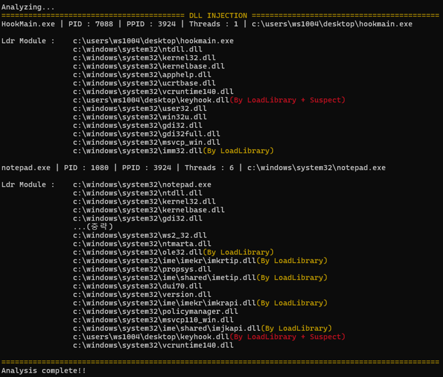
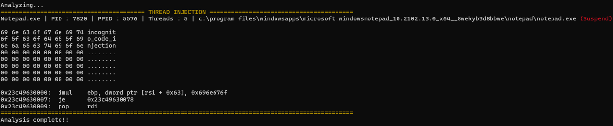
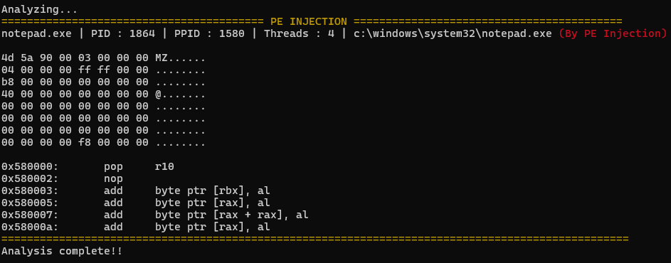

# Detect Injection - Volatility 3 Plugin

## Description
`detect_injection` is a custom plugin for Volatility 3 that allows the detection of various process injection techniques in memory dumps. This plugin focuses on identifying DLL injection, Thread injection, and PE injection in running processes on a Windows system.

We will detect more Injections through additional research in the future.

## Requirements
- Python 3.10 or higher
- Volatility 3 Framework (version. 2.5.2 or higher)
- Required modules:
    - `pefile`

## Installation
To use this plugin, you need to install the following dependencies.
```markdown
pip install -r requirements.txt
```

## Usage
To run the detect_injection plugin, you need a memory dump and at least one of the following options: `--dll`, `--thread`, or `--pe`.

Also save the detect_injection.py file in the path volatility3/volatility3/framework/plugins/windows/detect_injection.py.

### Basic Command : 
```markdown
python vol.py -c config.json -f [memory_dump.raw] windows.detect_injection -h
```
### Options : 
- `--dll` : Detect DLL Injection in processes.
- `--thread` : Detect Thread Injection in processes.
- `--pe` : Detect PE Injection in processes.

### Example Commands : 
1. Detect DLL Injection : 
    ```markdown
    python vol.py -c config.json -f [memory_dump.raw] windows.detect_injection --dll
    ```
2. Detect Thread Injection : 
    ```markdown
    python vol.py -c config.json -f [memory_dump.raw] windows.detect_injection --thread
    ```
3. Detect PE Injection : 
    ```markdown
    python vol.py -c config.json -f [memory_dump.raw] windows.detect_injection --pe
    ```

## Output

### Example Output : 

#### Detect DLL Injection (--dll)


#### Detect Thread Injection (--thread)


#### Detect PE Injection (--pe)


## Error Handling
If no valid option (--dll, --thread, --pe) is specified, the plugin will raise an error and terminate.

```markdown
At least one option (dll, thread, or pe) must be set.
Use -h for more information.
```

## License
This plugin is distributed under the MIT License. See the LICENSE file for more details.

## Author
- Name : ws1004(GyuBin Kim)
- Email : ws1004@kakao.com
- Version : 1.0.0